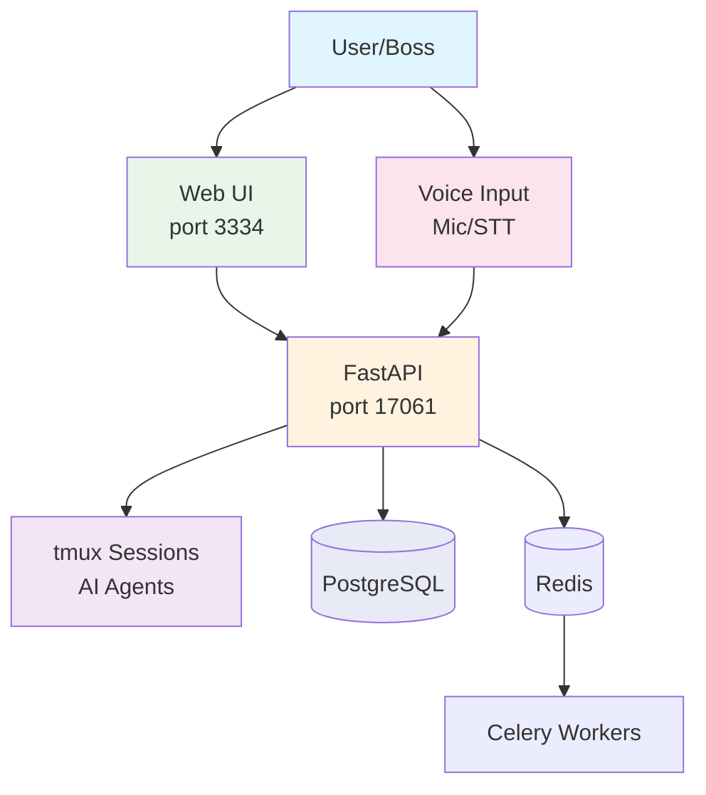
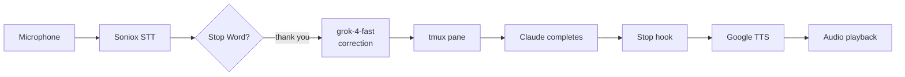

<!-- last_verified: 2026-02-10 -->
# Architecture Overview

System design and key patterns for the AI Teams Controller.

## System Diagram



## Core Concepts

### Teams and Roles

- **Team** = tmux session (e.g., `command-center`, `trading-bot`)
- **Role** = tmux pane within session (e.g., `pane-0` = PO, `pane-1` = SM)
- Each role runs a Claude Code instance with a specific purpose

### Two-Enter Rule

When sending commands to Claude Code in tmux, two Enter keypresses are required with 0.3s delay. The `tm-send` utility handles this automatically.

### Voice Command Flow



1. User speaks → Soniox transcribes in real-time
2. Stop word detected → send to LLM for correction
3. Corrected command → sent to tmux pane
4. Claude completes → Stop hook fires → TTS feedback

### Activity Detection

- Backend polls pane output every 5 seconds
- Compares content hash to detect changes
- Frontend shows green (active) / gray (idle) indicators

## Key Patterns

### Strategy Pattern (Backend)

```python
class TeamService(ABC):
    def get_teams(self) -> list[dict]: ...
    def send_message(self, team_id, role_id, message) -> dict: ...

class TmuxService(TeamService):  # Production
class MockDataService(TeamService):  # Testing
```

### TTS Provider Factory

Switchable TTS providers via environment variable:

```python
tts = TTSProviderFactory.create()  # Uses TTS_PROVIDER env
audio = tts.generate_speech("Task completed")
```

| Provider | Cost | Quality |
|----------|------|---------|
| Google Cloud Standard | $4/million chars | Good |
| HD-TTS (self-hosted) | Free | Excellent |

### URL Strategy (WebSocket)

- **HTTP (REST)**: Relative URLs `/api/...` → Next.js proxies to backend
- **WebSocket**: Direct `ws://backend:port` → bypasses Next.js

## Data Flow

### REST API

```
Frontend → /api/teams → Backend → tmux list-sessions
Frontend → /api/send/{team}/{role} → Backend → tm-send
```

### WebSocket

```
Frontend ↔ ws://backend:17061/api/ws/state/{team}/{role}
         ↔ ws://backend:17061/api/voice/ws/feedback/global
```

### Background Tasks

```
Stop Hook → FastAPI → Celery Task → LLM Summary → TTS → Redis Pub/Sub → WebSocket
```

## Environment Variables

| Variable | Required | Description |
|----------|----------|-------------|
| `DATABASE_URL` | Yes | PostgreSQL connection |
| `JWT_SECRET_KEY` | Yes | JWT token signing |
| `SONIOX_API_KEY` | Yes | Speech-to-text |
| `XAI_API_KEY` | Yes | LLM command correction |
| `TTS_PROVIDER` | No | `google` (default) or `hdtts` |
| `GOOGLE_APPLICATION_CREDENTIALS` | Conditional | Google Cloud TTS |

## Further Reading

- [Backend Guide](./backend/README.md) - API endpoints, services, database
- [Frontend Guide](./frontend/README.md) - Components, hooks, state management
